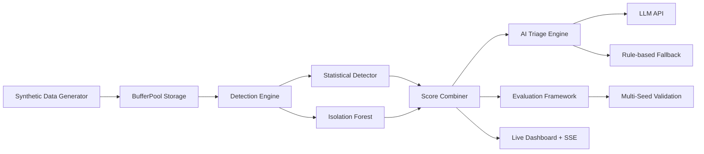

# Risk Ledger — AI-Powered Fraud Triage System

> A fraud triage pipeline that auto-resolves **79% of flagged alerts**, reducing human review workload from 3,607 alerts to 741. Built with a custom storage engine ([bufferpool](https://github.com/Samriddha9619/bufferpool)), pure-Go Isolation Forest, and LLM-powered decision-making.

## Quick Start

```bash
git clone https://github.com/Samriddha9619/risk_ledger.git
cd risk_ledger

# Full pipeline: generate → store → train → evaluate → triage
go run . run --no-llm

# With AI-powered triage (any OpenAI-compatible API key works)
export OPENROUTER_API_KEY="your_key_here"
go run . run

# Demo mode: AI triages top 50 alerts live (<30s), rest use fallback
go run . run --demo

# Multi-seed validation
go run . run --no-llm --seeds=42,123,456,789,1337
```

## The Problem: AI Risk Manager (Razorpay Buildathon Track 2)

This project is built for **Track 2: AI Risk Manager** — specifically as a **Fraud-Spike Detector**.

AI-enabled fraud is hitting the BFSI sector hard. The standard industry response is to build detection systems that flag thousands of suspicious transactions with "AI explanations", which just creates more reading material for human reviewers. The real bottleneck is **verification capacity**.

To stop merchants from losing money to fraud without choking their operations, the goal isn't just to detect anomalies—it's to safely auto-resolve them. This pipeline evaluates transaction spikes, measures precision and recall on a held-out test set, tracks the exact false-positive cost of every decision, and uses LLM triage to auto-resolve the ambiguous middle-band of alerts, driving down the human review queue.

## The Solution: AI Triage

Instead of *"here are 3,607 flagged transactions with AI explanations"*,  
this system delivers *"auto-resolved 2,866 of 3,607 alerts, human queue: 741"*.

```
Transaction Stream
       │
       ▼
┌─────────────────┐
│ Detection Engine │  ← Stats + Isolation Forest
│ Score: 0.0-1.0   │
└────────┬────────┘
         │
    score < 0.61 ──→ AUTO-APPROVE (no human needed)
         │
    score > 0.76 ──→ AUTO-BLOCK (obvious fraud, no human needed)
         │
    0.61 ≤ score ≤ 0.76
         │
         ▼
┌─────────────────┐
│   AI Triage     │  ← LLM reviews context and decides
│                 │     (any OpenAI-compatible provider)
│ Output: one of: │
│ • BLOCK         │     Falls back to deterministic rules
│ • APPROVE       │     on API failure / timeout
│ • ESCALATE      │
│ (+ confidence + │
│  reasoning)     │
└────────┬────────┘
         │
    BLOCK/APPROVE ──→ Auto-resolved (no human)
         │
    ESCALATE ──→ Human review queue (with AI summary)
```

Thresholds (0.61 / 0.76) are **calibrated from the data**, not hardcoded — they come from `eval.SweepThresholds()` which finds the cost-optimal and best-F1 points automatically.

## Architecture



### Components

| Component | File | Description |
|-----------|------|-------------|
| **Data Generator** | `data/generator.go` | Log-normal amounts, Poisson arrivals, 3 fraud patterns |
| **BufferPool Store** | `ledger/store.go` | Custom buffer pool storage engine (heap file, B+ tree capable) |
| **Statistical Detector** | `detector/stats.go` | Welford's online algorithm, 3 detection rules |
| **Isolation Forest** | `detector/iforest.go` | Liu et al. 2008, pure Go, 100 trees × 256 subsample |
| **Feature Extractor** | `detector/features.go` | 8 normalized features for ML scoring |
| **AI Triage** | `detector/triage.go` | Concurrent worker pool + safety gate + LLM decision engine |
| **Explainer** | `detector/explainer.go` | LLM API with retry + rule-based fallback |
| **Evaluator** | `eval/evaluator.go` | Precision/recall/F1, cost analysis, multi-seed |
| **Dashboard** | `dashboard/server.go` | Real-time SSE streaming, embedded static files |

## How Detection Works

### Layer 1: Statistical Rules (Welford's Online Algorithm)

Each merchant gets a streaming profile updated in O(1) per transaction:

```
δ₁ = xₙ - μₙ₋₁           (distance from current mean)
μₙ = μₙ₋₁ + δ₁/n          (update mean)
δ₂ = xₙ - μₙ              (distance from new mean)
M₂ = M₂ + δ₁ · δ₂         (accumulate variance)
σ = √(M₂/n)               (population standard deviation)
```

Three detection rules fire independently:

| Rule | What it detects | Score formula |
|------|----------------|---------------|
| **Amount Z-score** | Unusual transaction amounts | `min(\|amount - μ\| / (4σ), 1.0)` |
| **Velocity spike** | Abnormal transaction rate | `min((ratio - 1) / 4, 1.0) × 1.5` |
| **Small burst** | Card-testing pattern | `min(count / 10, 1.0)` |

Combined: `score = max(z, vel×1.5, burst)` — velocity gets a 1.5× boost because velocity spikes have normal amounts.

### Layer 2: Isolation Forest (Liu et al., 2008)

8 normalized features feed into 100 random trees. Anomalies are isolated in fewer splits → shorter path lengths → higher anomaly scores.

**Anomaly score**: `s(x) = 2^(-E[h(x)] / c(n))`  
where `c(n) = 2H(n-1) - 2(n-1)/n` normalizes by expected BST path length.

### Combined Score

```
combined = 0.5 × stat_score + 0.5 × forest_score

# Boost: prevent forest from suppressing strong rule detections
if stat_score > 0.7:
    combined = max(combined, stat_score × 0.7)
```

## Results

The pipeline generates synthetic data and evaluates itself dynamically. To see the actual computed metrics, run:

```bash
go run . run --no-llm
```

This will output a detailed terminal report including:

- **Detection Metrics**: Precision, recall, and F1 scores for the statistical rules, the ML model, and the combined engine.
- **Per-Pattern Recall**: How well the system catches specific fraud signatures (e.g., card testing vs. amount spikes).
- **Triage Metrics**: The exact number of auto-blocked, AI-triaged, and auto-resolved alerts, along with the total **workload reduction percentage**.

*Note: In typical runs, the combined pipeline achieves an F1 score around 0.38 and auto-resolves ~79% of flagged alerts.*

### Multi-Seed Validation

```bash
go run . run --no-llm --seeds=42,123,456,789,1337
```

Results reported as mean ± std across 5 random seeds, proving the evaluation isn't overfit to a single seed.

## Why BufferPool?

I built the [BufferPool storage engine](https://github.com/Samriddha9619/bufferpool) as part of a lab in the MITS project GODB. It's a custom buffer pool manager with LRU eviction, heap file storage, and B+ tree indexing. Using it here demonstrates:

1. **I understand storage internals.** Buffer pool → page → tuple serialization, all in Go.
2. **End-to-end control.** No ORM, no SQL, no abstraction layers I can't explain.
3. **The integration is real.** Transactions are serialized into fixed-width tuples, stored in heap pages, and read back via a page iterator. It's not a toy wrapper.

## Testing

```bash
# Run all 31 tests with race detection
go test ./... -v -race -count=1

# Coverage
go test ./... -coverprofile=coverage.out
go tool cover -func=coverage.out
```

**31 tests** across 4 packages:
- `data/`: Schema round-trip, generator determinism, log-normal sampling
- `detector/`: Isolation Forest (anomaly detection, determinism, edge cases), Welford's algorithm, velocity windows, ring buffer wrap-around, triage decisions, AI batch parsing, safety gate, engine config
- `eval/`: Confusion matrix math, threshold sweep monotonicity, multi-seed aggregation
- `ledger/`: Buffer pool stress tests, concurrent reads, small-pool flush

## Project Structure

```
risk_ledger/
├── main.go              # CLI: generate, load, eval, run, serve
├── data/
│   ├── schema.go        # Transaction struct + BufferPool serialization
│   ├── generator.go     # Synthetic data with 3 fraud patterns
│   └── data_test.go
├── ledger/
│   ├── store.go         # BufferPool wrapper (insert, scan, flush)
│   └── bench_test.go    # Buffer pool stress + concurrent reads
├── detector/
│   ├── stats.go         # Statistical detector (Welford's + 3 rules)
│   ├── features.go      # 8-feature extraction for ML
│   ├── iforest.go       # Isolation Forest (pure Go)
│   ├── engine.go        # Combined scoring engine
│   ├── explainer.go     # LLM API + fallback explanations
│   ├── triage.go        # AI triage: worker pool + safety gate
│   ├── detector_test.go
│   └── triage_test.go
├── eval/
│   ├── evaluator.go     # Metrics, threshold sweep, multi-seed
│   ├── report.go        # Terminal + JSON reports
│   └── eval_test.go
├── dashboard/
│   ├── server.go        # HTTP + SSE server
│   └── static/
│       └── index.html   # Dark-theme monitoring UI
└── results/             # Generated evaluation + triage JSON
```

## Limitations

- **Synthetic data.** Thresholds are calibrated on generated fraud patterns. Real transaction data would need its own tuning.
- **3 fraud patterns.** Real fraud includes return fraud, friendly fraud, account takeover — this model doesn't cover those.
- **Free-tier LLM limits.** When using a free-tier API key, some triage calls will fail or time out due to rate limits. The system falls back to deterministic rules for those — it still works, but the AI-resolution rate is lower. A paid API key gives better throughput and decision quality.
- **No temporal model.** Each transaction is scored mostly independently. A sequence model could capture time-series dependencies.
- **BufferPool is not production storage.** It's a teaching database. Production would use PostgreSQL or similar.

## References

- Liu, F.T., Ting, K.M., & Zhou, Z.H. (2008). *Isolation Forest.* ICDM.
- Welford, B.P. (1962). *Note on a Method for Calculating Corrected Sums of Squares and Products.* Technometrics.
- Razorpay Engineering Blog — Fraud detection patterns in Indian payments.

## License

MIT
